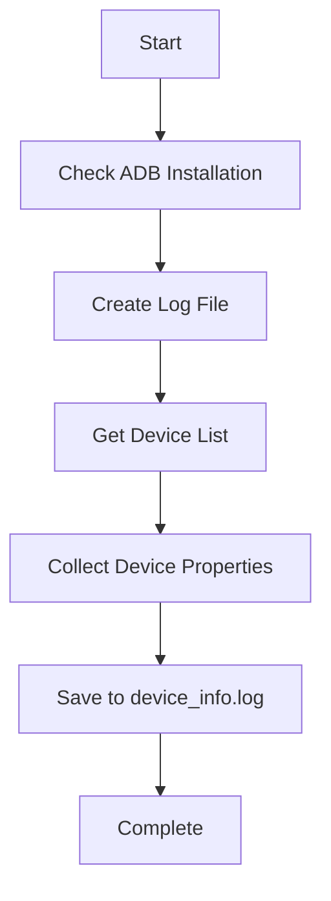
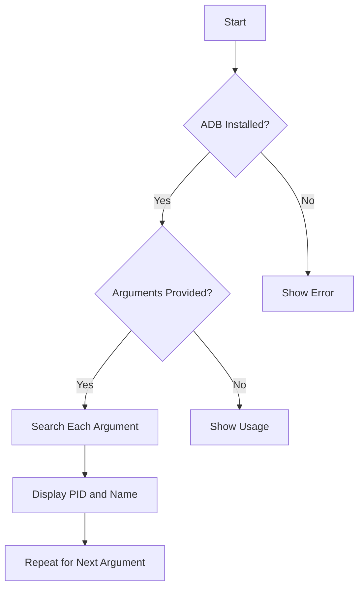

# Ransomware Syscall Monitoring System

This project is still under development (WIP). Some scripts are not documented yet, such as the dependency installation scripts and some other files.

## 1. Introduction

Shell scripts that detects ransomware activity by monitoring suspicious and normal system call patterns using `strace`.

### 🔍 1.2 Key Syscall Patterns

#### 🗂️ 1.2.1 File Operations
```bash
grep -e 'open(.*O_RDWR' -e 'rename(.*\.encrypted' -e 'unlink(.*\.bak' strace.log
```
- `open()` with write flags
- `rename()` to suspicious extensions
- Batch `unlink()` operations

#### 🌐 1.2.2 Network Activities  
```bash
grep -e 'connect(.*:443' -e 'sendto(.*[0-9]{1,3}\.[0-9]{1,3}\.[0-9]{1,3}\.[0-9]{1,3}' strace.log
```
- Outbound HTTPS connections
- Communication with unknown IPs

#### 🧠 1.2.3 Process Manipulation
```bash
grep -e 'mprotect(.*PROT_EXEC' -e 'mmap(.*PROT_WRITE' strace.log
```
- Memory protection changes
- Suspicious memory mapping


### 📌 1.3 Usage Guide
1. Start monitoring:
   ```bash 
   ./capture_logs.sh <com.example1>
   ```

### ⚠️ 1.4 Requirements
- Linux/Unix system
- strace and tcpdump installed
- Root privileges for system-wide monitoring


## 2. Android Environment Setup Script

```bash
#!/bin/bash
# Android Development Environment Configuration Script
# Sets paths and variables for Android SDK/NDK development
```

### 📋 2.1 Script Purpose
Configures your shell environment for Android development by:
- Setting all required SDK/NDK paths
- Preparing cross-compilation toolchain
- Verifying ADB connectivity

### 🛠️ 2.2 Components Configured
| Component          | Path Example                          |
|--------------------|---------------------------------------|
| Platform Tools     | `$ANDROID_SDK_ROOT/platform-tools`    |
| CMake              | `$ANDROID_SDK_ROOT/cmake/3.31.6/bin`  |
| Command Line Tools | `$ANDROID_SDK_ROOT/cmdline-tools/latest/bin` |
| Emulator          | `$ANDROID_SDK_ROOT/emulator`          |
| NDK               | `$ANDROID_SDK_ROOT/ndk/29.0.13113456` |

### 🔧 2.3 Toolchain Configuration
```bash
export TARGET=armv7a-linux-androideabi  # ARM 32-bit
export API=21  # Min Android version
export CC=$TOOLCHAIN/bin/$TARGET$API-clang  # C compiler
```

### 📱 2.4 ADB Verification
```bash
adb devices  # Checks connected devices
```


## 3. Android Device Information Collector

```bash
#!/bin/bash
# Android Device Information Script
# Collects and logs key device properties via ADB
```

### 📋 3.1 Script Purpose
Automatically gathers and saves essential Android device information including:
- Connected devices list
- Device model and manufacturer
- Product identifiers
- Hardware properties

### 🔍 3.2 Collected Information
| Property               | ADB Command                          | Example Output        |
|------------------------|--------------------------------------|-----------------------|
| Connected Devices      | `adb devices`                        | `emulator-5554 device`|
| Product/Device Alias   | `getprop ro.product.device`          | `walleye`             |
| Device Model           | `getprop ro.product.model`           | `Pixel 2`             |
| Product Name           | `getprop ro.product.name`            | `walleye`             |
| Manufacturer           | `getprop ro.product.manufacturer`    | `Google`              |

### 📊 3.3 Visual Flow


### 🚀 3.4 Usage
1. Make executable:
   ```bash
   chmod +x get_device_info.sh
   ```
3. Run:
   ```bash
   ./get_device_info.sh
   ```

### 📂 3.5 Output Example
Creates `device_info.log` with content like:
```
Checking connected devices...
List of devices attached
emulator-5554	device

Product/Device alias:
walleye

Device Model:
Pixel 2

Product Name:
walleye

Manufacturer:
Google
```

### 💡 3.6 Pro Tips
- Connect only one device for clean output
- Works with both physical devices and emulators
- Add more properties by extending the script:
  ```bash
  echo "\nAndroid Version:" | tee -a $filename
  adb shell getprop ro.build.version.release | tee -a $filename
  ```

### 🛠️ 3.7 Troubleshooting
If you get errors:
1. Verify USB debugging is enabled
2. Check `adb devices` shows your device
3. Ensure you've accepted the RSA key dialog
4. Try restarting ADB server:
   ```bash
   adb kill-server && adb start-server
   ```

### ⚠️ 3.8 Important Notes
- Requires USB debugging authorization
- Needs ADB in your PATH
- Log file is overwritten on each run


## 4. Android Process Search Tool

```bash
#!/bin/bash
# Android Process Finder Script
# Searches for running processes by package name/identifier
```

### 📋 4.1 Script Purpose
- Find running Android processes by package name
- Display matching process IDs (PIDs) and names
- Handle multiple search terms in one command

### 🔍 4.2 How It Works
1. Verifies ADB is installed
2. Checks for required arguments
3. Searches `ps -A` output for each argument
4. Displays PID and process name for matches

### 🖥️ 4.3 Usage Syntax
```bash
./search_app.sh <com.example1> <com.example2> ...
```

### 📊 4.4 Visual Flow


### 🛠️ 4.5 Example Commands
```bash
# Single package search
./search_app.sh com.google

# Multiple package search
./search_app.sh com.android chrome
```

### 📝 4.6 Sample Output
```
Searching for processes matching: com.google chrome
----------------------------------
>>> Processes containing 'com.google':
PID: 1234   Name: com.google.android.gms
PID: 5678   Name: com.google.process.gapps
----------------------------------
>>> Processes containing 'chrome':
PID: 9012   Name: com.android.chrome
----------------------------------
```

### ⚠️ 4.7 Requirements
- Android Debug Bridge (ADB) installed
- USB debugging enabled
- Device connected and authorized

### 🛠️ 4.8 Troubleshooting
If no processes appear:
1. Verify package names are correct
2. Check if app is actually running
3. Try broader search terms:
   ```bash
   ./search_app.sh android
   ```


## 5.

Aplicativos utilizados para este projeto

org.readera
com.spotify.music